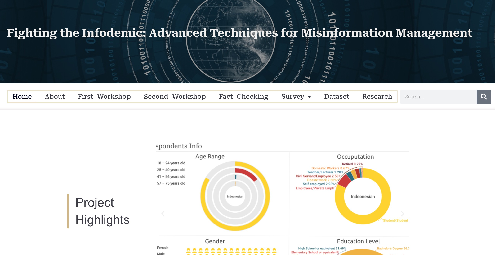
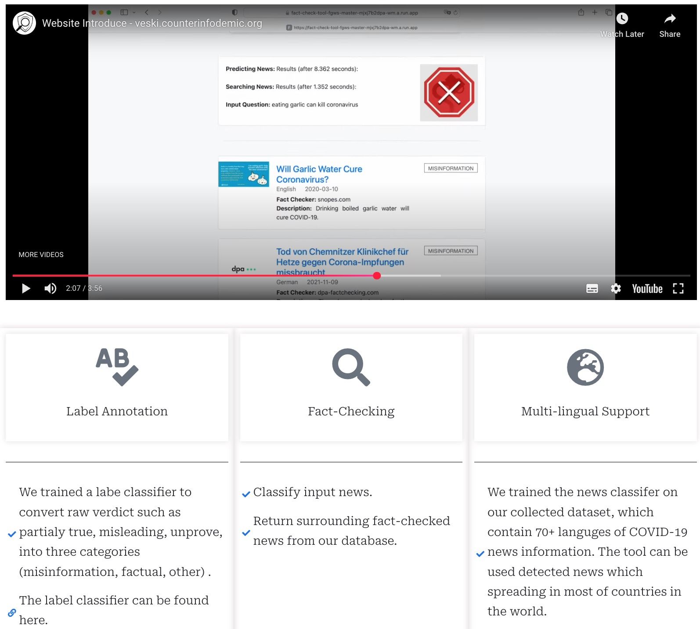
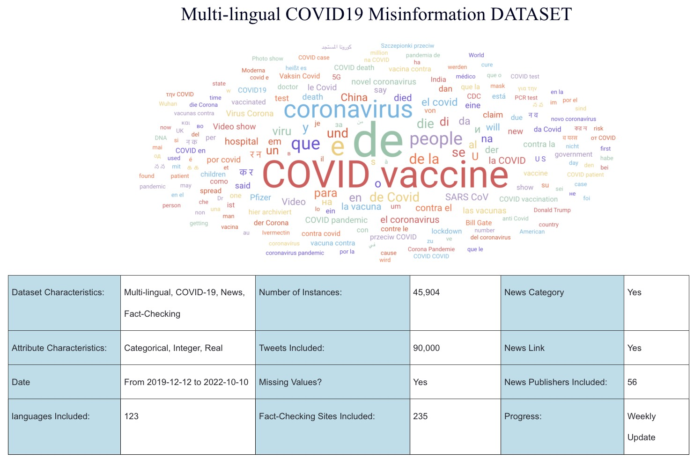
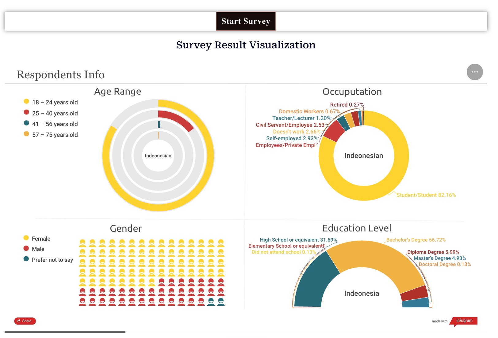

# 🦠 VESKI Infodemic Management Research Project

> **A multilingual research initiative detecting, classifying & countering COVID-19 misinformation on social media through AI-driven tools, open datasets and community workshops.**

**🌐 Web Platform** → <https://veski.counterinfodemic.org>  
**🎞️ Platform Demo** → [Watch on YouTube](https://youtu.be/d8kwXpryflY?si=aOcCZ2sR9nOXnaP2)

---

## 📋 Project Overview

The **"Multilingual COVID-19 Fake News Detection and Intervention on Social Media"** project represents a groundbreaking interdisciplinary initiative that bridges machine learning, data journalism, and public health research. By leveraging cutting-edge AI technologies and comprehensive multilingual datasets, this project empowers researchers, journalists, and policy-makers to effectively identify, analyze, and combat the spread of COVID-19 misinformation across diverse social media platforms.

Our comprehensive approach encompasses real-time detection systems, extensive data collection, user-friendly verification tools, and evidence-based intervention strategies to address the complex challenges of the global infodemic.

---

## 🎯 Research Objectives

- 🔍 **Build** the world's largest multilingual COVID-19 misinformation corpus spanning 52+ languages
- 🤖 **Develop** state-of-the-art detection & verification models for text and social context analysis
- 🛠️ **Design** intuitive fact-checking and visual analytics tools for end-users
- 🗣️ **Evaluate** intervention strategies through comprehensive surveys & community workshops
- 📊 **Provide** open-access resources for global research collaboration

---

## 🛠️ Tools & Resources

### ⚡ AI-Powered Fact-Checking Tool

An interactive web application that leverages advanced machine learning algorithms to classify COVID-19 related claims in real-time. The tool provides instant verdicts with confidence scores and detailed explanations of the decision-making process, making it accessible for both researchers and general users.

**Key Features:**
- Real-time claim verification
- Multilingual support
- Confidence scoring system
- Transparent decision explanations

---

### 📊 DataLab – Multilingual COVID-19 Misinformation Dataset

Our comprehensive dataset represents the most extensive collection of multilingual COVID-19 misinformation data available for academic research. Updated weekly with rich social engagement metadata, this resource enables researchers worldwide to develop and test their own detection models.

| **Metric** | **Value** |
|------------|-----------|
| **Total Records** | 45,904 news articles |
| **Languages Covered** | 52 languages |
| **Social Media Posts** | 90,000+ tweets |
| **News Publishers** | 56 verified sources |
| **Fact-checking Sites** | 235 international platforms |

**Dataset Features:**
- Weekly automated updates
- Rich metadata including social engagement metrics
- Verified fact-check labels
- Open access for academic use
- Standardized format for cross-platform compatibility

---

### 📑 Community Survey & Questionnaire

A comprehensive stratified online survey designed to understand public exposure patterns, belief systems, and behavioral responses to COVID-19 misinformation. Deployed across Indonesia and Australia, this research component provides crucial insights into the real-world impact of misinformation on diverse communities.

**Research Scope:**
- Cross-cultural comparative analysis
- Demographic stratification
- Behavioral pattern identification
- Intervention effectiveness measurement
- Policy recommendation development

*Conducted in partnership with Deakin University and Universitas Gadjah Mada*

---

### 🎓 Workshops & Outreach Programs

Our knowledge transfer initiative includes comprehensive research workshops that bring together international scholars, practicing journalists, and frontline health communicators. These collaborative sessions facilitate the sharing of methodologies, early research findings, and evidence-based policy recommendations.

**Workshop Series:**
- **First Workshop**: Methodological foundations and initial findings
- **Second Workshop**: Advanced techniques and policy applications
- **Ongoing Webinars**: Regular updates and community engagement

**📹 Workshop Recording** → [Watch on YouTube](https://youtu.be/VYwYN4etpcs?si=2UlPPy18Vx5tjWyI)

---

## 🤝 Team & Acknowledgements

This project is proudly funded by the **Study Melbourne Research Partnership (VESKI)** and represents a collaborative effort between leading academic institutions committed to combating health misinformation through evidence-based research.

**Lead Institutions:**
- **Deakin University** (Australia) - Primary Research Hub
- **Universitas Gadjah Mada** (Indonesia) - Regional Research Partner

**Special Recognition:**
We extend our gratitude to the international research community, fact-checking organizations, and social media platforms that have contributed data and expertise to this vital public health initiative.

---

## 📄 License & Citation

This project and its associated datasets are made available for academic and research purposes. Please refer to our [licensing terms](LICENSE) for detailed usage guidelines.

---

*Last Updated: 2024 | Project Status: Active Research Phase*

