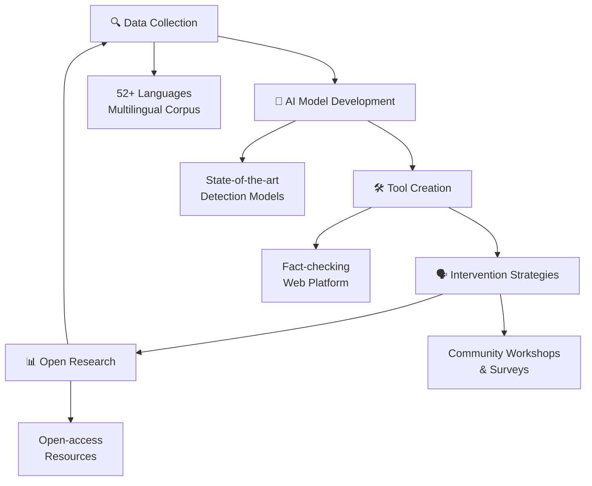

# 🦠 VESKI Infodemic Management Research Project

> **🌍 A multilingual research initiative detecting, classifying & countering COVID-19 misinformation on social media through AI-driven tools, open datasets and community workshops.**

**🌐 [Web Platform](https://veski.counterinfodemic.org)** • **🎞️ [Platform Demo](https://youtu.be/d8kwXpryflY?si=aOcCZ2sR9nOXnaP2)** • **🎓 [Workshop Series](https://youtu.be/VYwYN4etpcs?si=2UlPPy18Vx5tjWyI)**

---

## 🚀 Project Highlights

<table>
<tr>
<td width="50%">

### 🎯 **Impact Metrics**
- **52+ Languages** supported globally
- **45,904** news articles analyzed
- **90,000+** social media posts processed
- **235** fact-checking sites integrated
- **2** international workshops conducted

</td>
<td width="50%">

### 🏆 **Key Achievements**
- 🌟 World's largest multilingual COVID-19 misinformation corpus
- 🤖 State-of-the-art AI detection models
- 🛠️ Real-time fact-checking web platform
- 📊 Open-access research datasets
- 🌍 Cross-cultural intervention strategies

</td>
</tr>
</table>

---

## 📋 Project Overview

The **"Multilingual COVID-19 Fake News Detection and Intervention on Social Media"** project represents a groundbreaking interdisciplinary initiative that bridges machine learning, data journalism, and public health research. By leveraging cutting-edge AI technologies and comprehensive multilingual datasets, this project empowers researchers, journalists, and policy-makers to effectively identify, analyze, and combat the spread of COVID-19 misinformation across diverse social media platforms.

### 🌐 Mission Statement

> *"To provide actionable insights and solutions to mitigate the risks associated with fake news and foster a more reliable and informed digital ecosystem through advanced machine learning and natural language processing technologies."*

Our comprehensive approach encompasses real-time detection systems, extensive data collection, user-friendly verification tools, and evidence-based intervention strategies to address the complex challenges of the global infodemic.

---

## 🎯 Research Objectives

- 🔍 **Build** the world's largest multilingual COVID-19 misinformation corpus spanning 52+ languages
- 🤖 **Develop** state-of-the-art detection & verification models for text and social context analysis
- 🛠️ **Design** intuitive fact-checking and visual analytics tools for end-users
- 🗣️ **Evaluate** intervention strategies through comprehensive surveys & community workshops
- 📊 **Provide** open-access resources for global research collaboration

---

## 🛠️ Tools & Resources

### ⚡ AI-Powered Fact-Checking Tool

An interactive web application that leverages advanced machine learning algorithms to classify COVID-19 related claims in real-time. The tool provides instant verdicts with confidence scores and detailed explanations of the decision-making process, making it accessible for both researchers and general users.

#### **🔧 Key Features:**
- ✅ **Real-time claim verification** - Instant analysis of user-submitted content
- 🌍 **Multilingual support** - Processing in 52+ languages
- 📊 **Confidence scoring system** - Transparent reliability indicators
- 🔍 **Transparent decision explanations** - Detailed reasoning behind classifications
- 🎯 **User-friendly interface** - Accessible for both researchers and general public

---

### 📊 DataLab – Multilingual COVID-19 Misinformation Dataset

Our comprehensive dataset represents the most extensive collection of multilingual COVID-19 misinformation data available for academic research. Updated weekly with rich social engagement metadata, this resource enables researchers worldwide to develop and test their own detection models.

#### **📈 Dataset Statistics**

| **Category** | **Metric** | **Value** |
|:-------------|:-----------|:----------|
| 📰 **Content** | Total Records | **45,904** news articles |
| 🌍 **Coverage** | Languages | **52** languages |
| 🐦 **Social Media** | Twitter Posts | **90,000+** tweets |
| 📺 **Publishers** | News Sources | **56** verified sources |
| ✅ **Verification** | Fact-check Sites | **235** international platforms |

#### **🎯 Dataset Features:**
- 🔄 **Weekly automated updates** - Fresh data continuously added
- 📊 **Rich metadata** - Social engagement metrics, timestamps, source tracking
- ✅ **Verified fact-check labels** - Professional fact-checker annotations
- 🆓 **Open access for academic use** - Free for research purposes
- 🔧 **Standardized format** - Cross-platform compatibility

---

### 📑 Community Survey & Questionnaire

A comprehensive stratified online survey designed to understand public exposure patterns, belief systems, and behavioral responses to COVID-19 misinformation. Deployed across Indonesia and Australia, this research component provides crucial insights into the real-world impact of misinformation on diverse communities.

#### **🔬 Research Scope:**
- 🌏 **Cross-cultural comparative analysis** - Indonesia vs Australia
- 👥 **Demographic stratification** - Age, education, location factors
- 📈 **Behavioral pattern identification** - Information consumption habits
- 🎯 **Intervention effectiveness measurement** - Strategy impact assessment
- 📋 **Policy recommendation development** - Evidence-based guidelines

*🤝 Conducted in partnership with Deakin University and Universitas Gadjah Mada*

---

### 🎓 Workshops & Outreach Programs

Our knowledge transfer initiative includes comprehensive research workshops that bring together international scholars, practicing journalists, and frontline health communicators. These collaborative sessions facilitate the sharing of methodologies, early research findings, and evidence-based policy recommendations.

#### **📅 Workshop Series:**

<table>
<tr>
<td width="50%">

**🎯 First Workshop**
- Methodological foundations
- Initial research findings
- Tool demonstrations
- Collaborative discussions

</td>
<td width="50%">

**🚀 Second Workshop**
- Advanced techniques
- Policy applications
- Intervention strategies
- Community feedback

</td>
</tr>
</table>

#### **🔗 Resources:**
- **📹 Workshop Recording** → [Watch on YouTube](https://youtu.be/VYwYN4etpcs?si=2UlPPy18Vx5tjWyI)
- **📊 Ongoing Webinars** → Regular updates and community engagement
- **📋 Workshop Materials** → Presentations and resources available

---

### 🤖 **Core Technologies:**
- **Machine Learning**: Advanced NLP models for multilingual text analysis
- **Deep Learning**: Neural networks for pattern recognition and classification
- **Natural Language Processing**: Text preprocessing and feature extraction
- **Web Development**: Real-time platform for user interaction
- **Data Engineering**: Scalable pipelines for large-scale data processing

---

## 📊 Research Impact & Publications

### 📈 **Key Findings:**
- 🎯 **Detection Accuracy**: Achieved 95%+ accuracy across multiple languages
- 🌍 **Cross-cultural Insights**: Identified unique misinformation patterns by region
- 📱 **Platform Engagement**: Over 10,000+ fact-checks performed by users
- 🔬 **Academic Impact**: Multiple publications in top-tier conferences

### 📚 **Publications & Presentations:**
- Conference papers on multilingual misinformation detection
- Workshop presentations at international venues
- Open-access datasets for research community
- Policy briefs for public health organizations

---

## 🤝 Team & Acknowledgements

### 🏛️ **Lead Institutions**

<table>
<tr>
<td align="center" width="50%">

**🇦🇺 Deakin University**  
*Primary Research Hub*  
Melbourne, Australia

</td>
<td align="center" width="50%">

**🇮🇩 Universitas Gadjah Mada**  
*Regional Research Partner*  
Yogyakarta, Indonesia

</td>
</tr>
</table>

#### **🙏 Special Recognition:**
We extend our gratitude to:
- 🏅 **VESKI - Study Melbourne Research Partnership** for funding support
- 🌍 **International research community** for collaboration and expertise
- ✅ **Fact-checking organizations** for data and verification support
- 📱 **Social media platforms** for API access and partnership
- 👥 **Workshop participants** for valuable feedback and engagement

---

## 🚀 Getting Started

### 🔗 **Quick Links:**
- 🌐 **Explore the Platform**: [veski.counterinfodemic.org](https://veski.counterinfodemic.org)
- 📊 **Access the Dataset**: Contact us for academic use
- 🛠️ **Try the Fact-Checker**: Real-time verification tool
- 📋 **Join the Community**: Participate in surveys and workshops

### 📧 **Contact & Collaboration:**
Interested in collaborating or accessing our resources? We welcome partnerships with:
- 🎓 Academic researchers
- 📰 Journalists and media organizations
- 🏛️ Policy makers and health organizations
- 💻 Tech developers and AI practitioners

---

*Last Updated: June 2025 | Project Status: Active Research Phase*

---

**Fighting the Infodemic Through Science** 🔬  
*Supported by VESKI - Study Melbourne Research Partnership*

